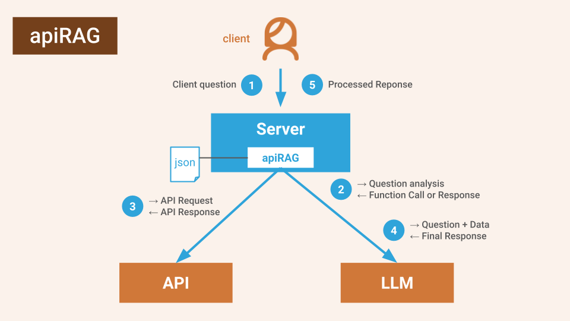

# Acorn Agent

Acorn Agent is a simple and flexible framework for building AI Agents, Chat Bots, and generative AI applications on the JVM.

Acorn Agent builds on tooling support that most LLMs provide to seamlessly integrate (semi-)structured data from external data sources like APIs, databases, and generic function calls with generative AI for high quality results against your own data.

[visual of data in - acorn agent in the middle - use cases out (like llamaindex)]

## What can You Build with Acorn Agent?

* Chat Bots that retrieve question-specific information from APIs, databases, and other sources on demand.
* AI frontend applications for GraphQL and REST APIs that customize and visualize responses.
* AI Agents that plan and execute actions against existing APIs.
* Semantic search engines structured, semi-structured, and unstructured data that use LLMs for targeted information retrieval.
* AI powered dashboards
* Agents that extract structured data for planning and actions.

Take a look at the [examples](/examples) for agents built with Acorn Agent.

## Why Acorn Agent?

Most agent frameworks are either too complex with lots of connectors, configurations, and options or abstract too much away from the actual LLM calls which doesn't give you enough control to fine-tune and cost-optimize your agents.

We wanted to build an agent framework that makes it easy to get started and experiment with different models but doesn't leave you hanging when you need low-level control to optimize performance and cost. In addition, we wanted an agent framework that automatically benefits from the rapid innovation on LLMs without requiring rewriting your agent.

* Acorn Agent is simple: It manages and invokes tools for LLMs efficiently and safely. That's it. [We believe tools are all you need](#tools-are-all-you-need) to succeed with LLMs. And it future-proofs your agent as LLMs get better and better at using tools.
* Acorn Agent is flexible: you can use the lightweight abstraction layers that Acorn agent provides to get started quickly and swap out models easily, but you can also use the tooling framework with any model client library or model API for full control over each model invocation.

## Acorn Agent Features

* On-Demand Data Retrieval from GraphQL APIs, REST APIs, or JDBC-compatible databases.
* Pluggable models and model providers like OpenAI (GPT models), Bedrock (Llama, and others), Google Vertex (Gemini), and Groq (Llama, Mixtral, and others).
* Message history to preserve context between agent interactions.
* Custom data visualizations.
* Easy integration with Spring Boot and other web development frameworks with in-code or file-based configuration.
* UI integration through function callbacks.
* Secure sandboxing of external system calls by injecting authentication information outside the LLM callstack.
* Ability to fine-tune context window for quality and cost optimization.

## Getting Started with Acorn Agent

### No Code

Invoke the Acorn Agent docker image with an agent and a tools configuration file. 

```bash
command example [AGENT_CONFIGURATION] [TOOLS_CONFIGURATION]
```

* Agent Configuration File: Configures the LLM, model provider, system prompt, and other agent settings. See [the configuration documentation](java/apirag-config/) for all options.
* Tools Configuration File: Configures the tools that the LLM can invoke to retrieve information, trigger actions, execute a function, or send a callback to the client. See the [tools configuration](TOOLS_CONFIG.md) for more information. As a simpler alternative, you can also provide a GraphQL schema with documentation which Acorn Agent automatically translates to tools.

Take a look at the [Acorn Agent examples](examples/) for inspiration and ready-to-run examples that you can use as a starting point.

### JVM (Java, Scala, Groovy, Clojure)

Check out the [Getting Started Documentation](java/README.md) for how to build your own custom agent with Acorn Agent:

* as a Spring Boot web application
* using the Model-abstraction interface
* or with low-level access to the model

## How does Acorn Agent Work?



Acorn Agent is essentially just a tools management framework with some convenient (and optional) abstraction layers for faster development.

You define the tools through a [configuration file](TOOLS_CONFIG.md) or in-code and Acorn Agent instruments those tools into the LLM and manages tool call validation and tool execution. To make sure that tools are executed safely and securely, you can define a "context" based on authentication or session information (e.g. a user id) which gets injected into the tool call outside the callstack of the LLM to eliminate injection attacks.

In addition, Acorn Agents provides features for message persistence and retrieval to preserve message context between invocations.

On top of that, Acorn Agents provides abstraction layers that make it simple and easy to replace models for fast experimentation.

## Acorn Agent Concepts

* Tools: Tools (sometimes also called "functions") are executables that can be invoked by the LLM to retrieve information or trigger an action. Many LLMs are specifically trained to use tools which makes this a natural interface between the LLM and other systems. Acorn Agent distinguishes 3 types of tools and provides the infrastructure to manage and invoke them:
  * API: An API tools executes as a query against another system through an API like GraphQL, REST, or JDBC (i.e. databases). Each API type has an associated APIExecutor that executes the queries.
  * Local: A tool that executes as a local function within the same instance that runs Acorn Agent.
  * Client: A tool that is a callback to the client (e.g. for data visualization, UI updates, or other actions).
* Message: The communication between the user/application and an LLM is through messages. The sequence of messages is the message history.
* ToolsBackend: Is a repository for tools that manages tool invocation as well as message persistence and history retrieval.
* ChatSession: A ChatSession manages the interaction between the user/application and the LLM. It uses the ToolsBackend to add, validate and invoke tools. The primary purpose of the ChatSession is to determine the ContextWindow which defines the input to the LLM.
* ChatProvider: Is an abstraction layer that provides a message interface on top of various LLM models that makes it easy to swap out models while sacrificing some level of control over model invocations.

## Tools Are All You Need

We build Acorn Agent after we had the following "aha" moments:
* Advanced LLMs are better at figuring out what a user is asking for than any augmentation approaches we can build around them.
* LLMs are specifically trained on tool usage which is a great way for LLMs to invoke actions and pull information they need to satisfy a user request.

As LLMs rapidly improve and get better at using tools, we believe that "tooling" will become the primary interface through which LLMs interact with the outside world. They can use tools to retrieve information, trigger actions, present information to the user through visualizations, update the UI, etc. In other words, building GenAI applications comes down to providing LLMs with the best tools for the job.

That's why we build Acorn Agent as a tool-centric framework, because tools are all you need to turn an LLM into a full-featured AI agent.

Building AI applications around tooling is not only simpler (everything is a tool) and more flexible (the interface between the LLM and your agent is just a tool repository), but it also future-proves your GenAI application as LLMs will get better and better at using tools. The last thing you want to do is compete with LLMs on who is smarter in the long-run: your application or the LLM.

## Community

[Join our Slack](https://join.slack.com/t/datasqrlcommunity/shared_invite/zt-2l3rl1g6o-im6YXYCqU7t55CNaHqz_Kg) to ask questions or share your feedback.

If you encounter an issue or have an idea for a new feature, please create an issue.

We welcome community contributions to the project. Feel free to open a PR to fix an issue or add a feature. Hop on the Slack channel for support and guidance.

Acorn Agent is currently limited to JVM applications. We'd love to bring the idea of a tool-centric agent framework to other languages. If you want to help with a Python or JavaScript implementation, please reach out.

## When Should You NOT Use Acorn Agent

We believe that tooling-centric agent frameworks like Acorn Agent are superior to other approaches of augmenting LLMs with custom data sources like RAG, FLARE, or prompt engineering because LLMs are specifically trained on tool usage and their ability to use tools will dramatically increase over the next few years.

However, there are scenarios where a tool-centric approach is currently not ideal:
* You need to use a model that has not been trained on tool usage (see [above](#acorn-agent-features) which models Acorn Agent already supports). In this case, you have to build instrumentation around the LLM using a complex agent framework.
* You are dealing with entirely unstructured data and vector similarity is your primary method of retrieving augmenting information. In this case, you are better off using a general-purpose semantic search engine.