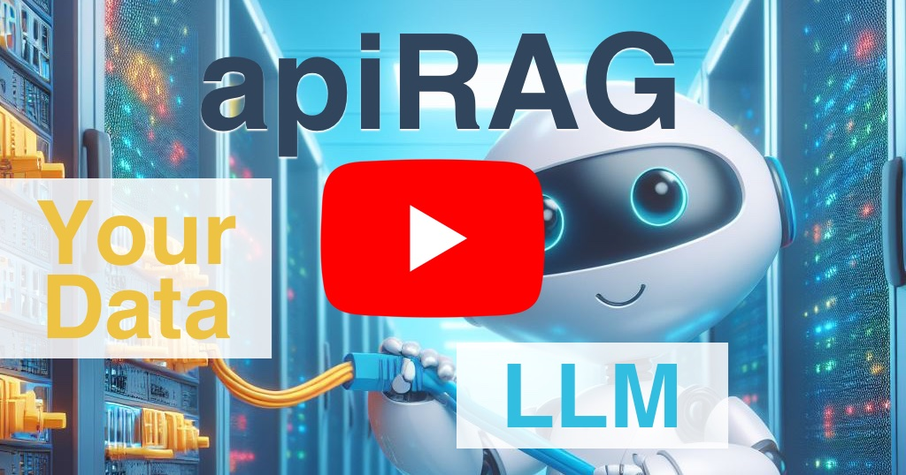

# apiRAG 🤖🔌

apiRAG makes it easy to augment Large Language Models with custom data provided by external APIs.

apiRAG solves the following use cases for Large Language Models (LLM), Generative AI, and ChatBots:
* Improve the breadth, depth, and accuracy of knowledge to answer user queries intelligently. For example, if you want to connect an LLM to an existing knowledge- or database to look up information as we do in our [Rick and Morty example](api-examples/rickandmorty).
* Access user specific or access controlled information to provided personalized answers in a secure manner. For example, allow the LLM to answer customer questions about their profile and transaction history as we do in our [Credit Card](api-examples/finance) and [Nutshop example](api-examples/nutshop).
* Include realtime information that updates frequently. For example, have an LLM analyze realtime sensor information as we do in our [Sensors example](api-examples/sensors).

apiRAG has the following benefits:
* High Quality: Benefits from the intelligence of the LLM to retrieve exactly the needed data.
* Efficiency: Retrieves only the data the LLM needs when it needs it.
* (Semi-)Structured Data: Works great with structured and semi-structured data for data analysis and visualization.
* Simplicity: It's essentially just a mapping layer between LLM function calls and API queries.
* Modularity: Separates the LLM instrumentation from the data augmentation providing a separation between "frontend" and "backend" and allows you to reuse your existing APIs.

To see a demo of apiRAG and how it works exactly, watch this video.

If you want to try out apiRAG yourself, check out the [examples](api-examples) for some example use cases and how they are implemented with apiRAG. Take a look at the language implementations for how to run the examples:
* [Java](java/)
* JavaScript (coming soon - please help!)
* Python (coming soon - please help!)

## How does this compare to RAG?

Currently, the most popular approach for augmenting LLMs with custom data is "Retrieval Augmented Generation". The basic idea behind RAG is to take a user query, retrieve information related to the query (usually by way of a vector embedding and vector database), and then put that information into the context for the LLM.

In other words, RAG is essentially a guess as to what the LLM might need to generate a good answer and loading it into the context. Because it relies on text or vector search, it only works effectively for use cases where the user question can be easily mapped to a good retrieval query.
And even for use cases where RAG works reasonably well - such as semantic search - it can be very inefficient. For example, if a user asks to "find all information on the 'nightfall' project from last December" RAG may find information on the project but has no way to limit it to the given timeframe. 

apiRAG does not suffer from these shortcomings because it relies on the LLM to determine what information it needs and relies on the intelligence of LLMs to translate user queries into efficient and relevant retrieval requests.

## How does apiRAG Work?

At it's core, apiRAG is a configuration format that defines a set of LLM functions and how they map to API queries.
It extends OpenAI's function call configuration with additional information on how to execute the function against an existing API.

For more information on apiRAG's configuration format, check out the [format documentation](FORMAT.md).

Each apiRAG language implementation is a mapping of the configuration format to the LLM instrumentation for that language. That means, you retain complete control over how the language model gets configured and executed and only need a very lightweight library for pulling in custom data.

apiRAG also introduces the notion of a "context", such as a user id, which is used to constrain the API calls to retrieve
information that pertains to the given context. That allows you to use apiRAG within an authenticated user session
and allowing the LLM to retrieve user-specific information without any danger of leaking information.

## Current Limitations

apiRAG is currently a proof-of-concept to demonstrate the utility and efficiency of the approach.
It is currently limited to OpenAI LLMs, GraphQL APIs, and only has a Java implementation.

We plan to overcome these limitations soon and are working on the following roadmap:
* Support for Python and JavaScript/TypeScript
* Support for REST APIs
* Support for open-source and additional LLMs (like Llama2)
* Support for additional API authentication modes

## Community

[Join our Discord](https://discord.gg/49AnhVY2w9) to ask questions or share your feedback.

We welcome community contributions to the project.