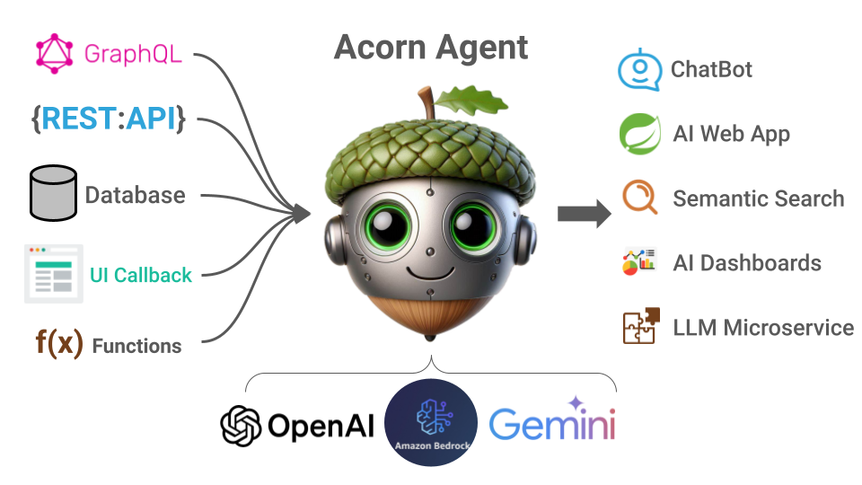

# Acorn Agent

Acorn Agent is a simple yet flexible framework for building AI Agents, Chat Bots, and LLM microservices on the JVM. It seamlessly integrates (semi-)structured data from various external sources—such as APIs, databases, and function calls—with Large-Language models through tooling to deliver high-quality results tailored to your application.



<!--
## What can You Build with Acorn Agent?

* Chat Bots that retrieve question-specific information from APIs, databases, and other sources on demand.
* AI frontend applications for GraphQL and REST APIs that customize and visualize responses.
* AI Agents that plan and execute actions against existing APIs.
* Semantic search engines based on  structured, semi-structured, and unstructured data that use LLMs for targeted information retrieval.
* AI powered dashboards
* Agents that extract structured data for planning and actions.

Take a look at the [examples](/examples) for agents built with Acorn Agent.
-->

## Acorn Agent Features

* **On-Demand Data Retrieval**: Access data from GraphQL APIs, REST APIs, or JDBC-compatible databases.
* **Pluggable Models**: Support for various model providers like OpenAI (GPT models), Bedrock (Llama, etc.), Google Vertex (Gemini, etc.), and Groq (Mixtral, etc.).
* **Message History**: Preserve context between agent interactions for coherent responses.
* **Custom Data Visualizations**: Integrate seamlessly with UI components.
* **Easy Integration**: Compatible with Spring Boot and other web frameworks, with both code and file-based configuration options.
* **Client-side Functions**: Safely execute client-side functions for UI integration.
* **Schema Validation**: Ensure tools definitions and calls by LLMs are valid.
* **Secure Sandboxing**: Inject authentication information outside the LLM call stack for safe external system calls.
* **Flexible Context Windows**: Optimize quality and cost by fine-tuning the context window.

## Getting Started with Acorn Agent

### No Code

Invoke the Acorn Agent Docker image with the required agent and tools configuration files, along with necessary environment variables for the model provider. 

[For example](examples/activity):

```bash
docker run -it --rm -p 8080:8080 -v $PWD:/config/ -e OPENAI_API_KEY=[YOUR_KEY] datasqrl/acorn:latest /config/activity.openai.config.json /config/activity.tools.json
```

To build your own agent, you need two things:
* Agent Configuration File: Configures the LLM, model provider, system prompt, and other agent settings. See [the configuration documentation](java/acorn-config/README.md) for details.
* Tools Configuration File: Configures the tools that the LLM can invoke to retrieve information, trigger actions, execute a function, or send a callback to the client. See the [tools configuration](TOOLS_CONFIG.md) for more information. Alternatively,  you can provide a [GraphQL schema with documentation](java/acorn-graphql/src/test/resources/graphql/nutshop-schema.graphqls) which Acorn Agent automatically translates to tools.

Take a look at the [Acorn Agent examples](examples/) for ready-to-run configuration and tool files.

### JVM (Java, Scala, Groovy, Clojure)

Check out the [Getting Started Documentation](java/README.md) for how to build your own custom agent with Acorn Agent:

* [As a Spring Boot web application](java/acorn-spring)
* [Using the Model-abstraction interface](https://github.com/DataSQRL/Acorn/tree/docu/starter/java/acorn-starter#configurablechatbot)
* [Or with low-level access to the model](https://github.com/DataSQRL/Acorn/tree/docu/starter/java/acorn-starter#lowlevelagent)

## Why Acorn Agent?

Many agent frameworks are either too complex or too abstract, making it difficult to fine-tune and cost-optimize your agents. Acorn Agent aims to simplify this process by providing a balance between ease of use and control. It allows for rapid experimentation with different models, while benefiting from the ongoing advancements in LLM technology.

* **Simple**: Manages and invokes tools for LLMs efficiently and safely.
* **Flexible**: Lightweight abstraction layers for quick setup and model swapping, with full control over model invocations when needed.

## How does Acorn Agent Work?


Acorn Agent is primarily a tools management and execution framework, with optional abstraction layers for faster development. You define [the tools](TOOLS_CONFIG.md) via a configuration file or in code. Acorn Agent then instruments these tools into the LLM, managing tool call validation and execution.

To ensure safety and security, you can define a "context" based on authentication or session information, which gets injected into the tool call outside the LLM call stack to prevent injection attacks. Additionally, Acorn Agent provides message persistence and retrieval to preserve context between interactions.

## Acorn Agent Concepts

* **Tools**: Executables invoked by the LLM to retrieve information or trigger actions. Many LLMs are specifically trained to use tools. Acorn Agent supports three types:
  * **API**: Executes as a query against another system (GraphQL, REST, JDBC) through the APIExecutor interface.
  * **Local**: Executes as a local function within the same instance.
  * **Client**: A callback to the client for UI updates or other actions.
* **Message**: The communication between the user/application and the LLM. The sequence of messages forms the message history.
* **ToolsBackend**: A repository for managing tool invocation, message persistence, and history retrieval.
* **ChatSession**: Manages interactions between the user/application and the LLM, utilizing ToolsBackend.
* **ChatProvider**: An abstraction layer providing a message interface on various LLM models, enabling easy model swapping.
* **Configuration**: Configures Acorn Agent components (APIExecutor, ChatProvider, LLM) through JSON config files or in-code via MapConfiguration.

## Tools Are All You Need

We built Acorn Agent based on the realization that:

* Advanced LLMs excel at understanding user requests better than any external augmentation.
* LLMs are trained to use tools, making this a natural interface for executing actions and retrieving information.

As LLMs improve, "tooling" will become the primary interface for LLM interactions. Building LLM applications around tools ensures simplicity, flexibility, and future-proofing, as LLMs will only get better at using tools.

## Community

[Join our Slack](https://join.slack.com/t/datasqrlcommunity/shared_invite/zt-2l3rl1g6o-im6YXYCqU7t55CNaHqz_Kg) to ask questions or share your feedback.

If you encounter an issue or have a feature idea, please create an issue. We welcome community contributions via PRs—hop on Slack for support and guidance.

Acorn Agent is currently limited to JVM applications. We're interested in extending to other languages like Python and JavaScript. If you'd like to help, please reach out.

## When Should You NOT Use Acorn Agent

While we believe a tool-centric framework has many advantages, it may not be ideal in certain scenarios:

* **Non-tool-trained Models**: If you need to use a model not trained on tool usage, you'll need a more complex framework.
* **Purely Unstructured Data**: If you're primarily dealing with unstructured data and rely on vector similarity for retrieval, a general-purpose semantic search engine may be more suitable.